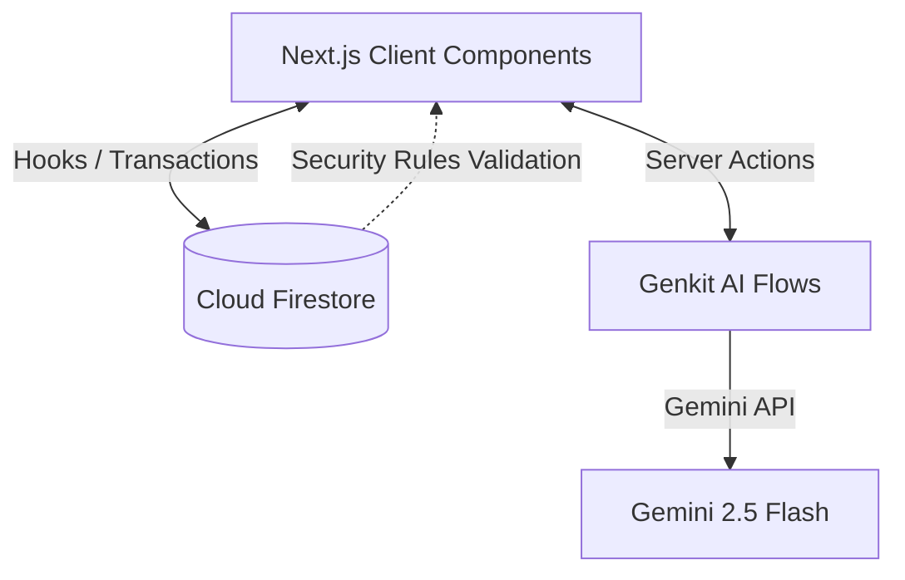

# ConnectFlow Pro - Architectural Design

This document details the system architecture of ConnectFlow Pro (also known as the Curatio Consultant Center), focusing on the integration of **Firebase Firestore**, **Next.js App Router (15.x)**, and the **Firebase Genkit** framework for running generative AI flows.

---

## 1. System Overview

ConnectFlow Pro is a dual-portal application designed to manage a global network of high-level consultant experts and match them to humanitarian and infrastructure projects.

### Core Stack
*   **Frontend & Server Components**: Next.js 15.5 (React 19) with TailwindCSS and Framer Motion.
*   **Database & Security**: Cloud Firestore with robust collection schemas and Role-Based Access Control (RBAC) security rules.
*   **Authentication**: Firebase Authentication.
*   **AI Orchestration**: Firebase Genkit (1.28.x) powered by the Google GenAI plugin (`googleai/gemini-2.5-flash`).



---

## 2. AI Tool Architecture (Firebase Genkit)

The generative AI features are implemented as **Genkit Flows** executing as Server Actions on the Next.js server-side, securing API keys from client exposure.

### Genkit Initializer
*   **File Path**: [genkit.ts](file:///Users/elene/Documents/Curatio%20Consultatnt/src/ai/genkit.ts)
*   **Configuration**: Initializes the Genkit instance using `@genkit-ai/google-genai` and configures the environment variable `GEMINI_API_KEY` for execution.
*   **Default Model**: `googleai/gemini-2.5-flash`.

### Developer Dashboard Setup
*   **File Path**: [dev.ts](file:///Users/elene/Documents/Curatio%20Consultatnt/src/ai/dev.ts)
*   **Purpose**: Bootstraps the local Genkit Developer UI which allows developers to run, inspect, and benchmark flows in isolation.
*   **NPM Scripts**:
    *   `npm run genkit:dev` — Starts Genkit CLI using `tsx` on `src/ai/dev.ts`.
    *   `npm run genkit:watch` — Runs Genkit CLI with hot-reloading.

---

## 3. Detail of Created AI Tools

### A. AI-Powered CV Insight Tool
Extracts and indexes resume structure automatically when an administrator reviews a consultant profile.

*   **Flow Module**: [admin-cv-insight-extraction.ts](file:///Users/elene/Documents/Curatio%20Consultatnt/src/ai/flows/admin-cv-insight-extraction.ts)
*   **Input Schema**:
    ```typescript
    {
      cvDataUri?: string; // Base64 data URI of the CV PDF
      cvUrl?: string;     // Public HTTP URL to download the CV PDF
    }
    ```
*   **Output Schema**:
    ```typescript
    {
      summary: string;              // Concise summary of the consultant's CV
      skills: string[];             // Array of key skills extracted
      experienceHighlights: string[]; // List of significant experiences / achievements
      qualifications: string[];     // List of academic or professional degrees
    }
    ```
*   **Implementation Flow**:
    1.  If a public `cvUrl` is provided instead of direct file data, the server issues a `fetch` request, retrieves the array buffer, and encodes the PDF contents into a base64 Data URI.
    2.  The flow calls `extractCvInsightsPrompt` with the Data URI as a media input `{{media url=cvDataUri}}`.
    3.  Gemini parses the PDF structural data and constructs a type-safe object conforming to the output schema.
*   **UI Integration**: Integrated in the consultant directory dashboard [admin-directory.tsx](file:///Users/elene/Documents/Curatio%20Consultatnt/src/components/dashboard/directory/admin-directory.tsx). The flow is initiated on row click. Once computed, the result is saved directly back to the database:
    ```typescript
    const result = await adminCvInsightExtraction({ cvUrl: consultant.cvUrl });
    const userRef = doc(db, "consultantProfiles", consultant.id);
    await updateDoc(userRef, { aiInsight: result });
    ```

---

### B. Opportunity Generator Tool
Assists administrators in creating professional, detailed project descriptions based on minimal input (e.g. project title and basic bullet points).

*   **Flow Module**: [generate-opportunity-flow.ts](file:///Users/elene/Documents/Curatio%20Consultatnt/src/ai/flows/generate-opportunity-flow.ts)
*   **Input Schema**:
    ```typescript
    {
      title: string;       // Proposed project title or role name
      context?: string;    // Raw description, notes, or bullet points
    }
    ```
*   **Output Schema**:
    ```typescript
    {
      title: string;              // Refined, professional title
      description: string;        // Compelling and detailed project brief
      tags: string[];             // Array of up to 5 skill/sector tags
      suggestedDuration: string;  // A realistic timeline estimate (e.g. '6 Months')
      suggestedRegion: string;    // Associated region or 'Global'
    }
    ```
*   **UI Integration**: Found in the "Post New Opportunity" dialog within [admin-opportunities.tsx](file:///Users/elene/Documents/Curatio%20Consultatnt/src/components/dashboard/opportunities/admin-opportunities.tsx). The "AI Auto-Fill" button fetches the generated details and populates form states dynamically before publishing.

---

### C. Consultant Matchmaking Tool
Ranks and evaluates all candidates who applied for a specific opportunity against its project brief and core requirements.

*   **Flow Module**: [match-consultants-flow.ts](file:///Users/elene/Documents/Curatio%20Consultatnt/src/ai/flows/match-consultants-flow.ts)
*   **Input Schema**:
    ```typescript
    {
      opportunityDescription: string; // Brief of the active project
      consultants: Array<{
        id: string;
        name: string;
        profession: string;
        sector: string;
        bio: string;
        years: number;
      }>;
    }
    ```
*   **Output Schema**:
    ```typescript
    {
      matches: Array<{
        consultantId: string;
        matchScore: number;     // Evaluation score from 0-100 indicating fit
        reasoning: string;      // Summary justification explaining the score
      }>;
    }
    ```
*   **UI Integration**: Triggered from the project applicant management screen in [admin-opportunities.tsx](file:///Users/elene/Documents/Curatio%20Consultatnt/src/components/dashboard/opportunities/admin-opportunities.tsx). Renders an "AI Match Insights" card showing sorted match scores and qualitative reasoning summaries.

---

## 4. Data Architecture & Firestore Schema

Data is stored in Cloud Firestore under structured paths matching the guidelines in [backend.json](file:///Users/elene/Documents/Curatio%20Consultatnt/docs/backend.json).

### Database Tree Map

```
/adminRoles/{userId}
   └─ (Admin access token reference)

/consultantRoles/{userId}
   └─ (Consultant access token reference)

/consultantProfiles/{userId}   --> UserProfile
   ├─ firstName, lastName, email, country, profession, sector, years, bio, status
   └─ aiInsight: { summary, skills, experienceHighlights, qualifications }

/opportunities/{opportunityId} --> Opportunity
   ├─ title, location, region, duration, deadline, description, tags, status
   └─ /applicants/{userId}     --> ApplicantData (Subcollection)
         └─ uid, name, email, location, status ('applied' | 'accepted' | 'declined'), appliedDate
```

### Access Authorization Logic (`firestore.rules`)
Firestore enforces granular restrictions before operations reach database documents:
1.  **Administrative Access**: Checked via `isAdmin()`, which validates custom Auth claims or checks if the user's UID exists in the `/adminRoles` collection.
2.  **Resource Ownership**: Validated via `isOwner(userId)`, matching `request.auth.uid` against document identifiers.
3.  **Path Controls**:
    *   Consultants can view their own profile and create/read applications.
    *   Administrators have read/write access to all tables, profiles, and opportunities, including running operations like verification and status updates.

---

## 5. Auxiliary Architecture Utilities

### Client-Side Image Compression
*   **File Path**: [image-utils.ts](file:///Users/elene/Documents/Curatio%20Consultatnt/src/lib/image-utils.ts)
*   **Implementation**: Utilizes an HTML5 Canvas API context to resize high-resolution images down to a maximum layout dimension (default `800px`) and convert the output to a compressed JPEG Blob (default quality `0.8`). Used to optimize consultant profile avatar uploads.

### Firebase Reactive Hooks
*   **File Paths**:
    *   [use-paginated-collection.tsx](file:///Users/elene/Documents/Curatio%20Consultatnt/src/firebase/firestore/use-paginated-collection.tsx): Handles client-side cursor pagination for massive lists like directories and project records.
    *   [use-collection.tsx](file:///Users/elene/Documents/Curatio%20Consultatnt/src/firebase/firestore/use-collection.tsx): Listens dynamically to collection changes (e.g. applications pipeline).

---

## 6. Core Application Workflows

### Public Project Sharing & Distribution
To seamlessly connect consultants with active projects, the platform features integrated public link distribution:
*   **Automatic URL Generation**: Upon publishing a new opportunity via the admin dashboard, the system generates a unique public URL (`/public/opportunities/[id]`) and surfaces it in a success dialog for immediate sharing.
*   **Quick Share Actions**: Every project card on the admin dashboard includes a one-click "Link" button. This utilizes the browser's `navigator.clipboard` API to copy the public URL, streamlining the external distribution of projects to consultants and other interested parties.
