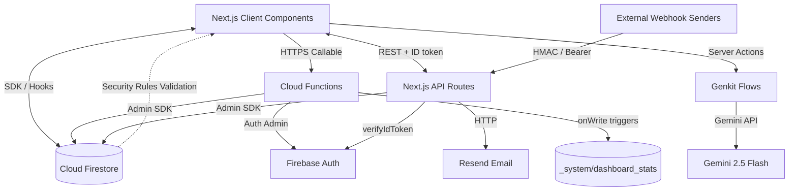

# Curatio Consultant Center — Technical Architecture

This document is the single source of truth for the technical direction of the **Curatio Consultant Center**, the consultant-management platform of the **Curatio International Foundation**. It describes the system architecture, data model, security posture, AI services, integrations, and operational procedures.

---

## 1. Product Overview

The Curatio Consultant Center is a dual-portal application that connects a global network of high-level consultants (legal, infrastructure, energy, governance, etc.) with humanitarian and infrastructure projects.

- **Admin portal** — directory management, verification, opportunities, AI-assisted matchmaking, analytics, email notifications.
- **Consultant portal** — profile management, verified expert network, opportunity browsing and applications.
- **Public surface** — shareable public opportunity pages where anyone can view a project and apply in a guided flow.

### Branding

| Token | Value |
|---|---|
| Organization | Curatio International Foundation |
| Product | Curatio Consultant Center |
| Email domain | `curatio.com` |
| Primary color | `#2666A6` (trustworthy blue) |
| Accent color | `#3CDDDD` (turquoise) |
| Background | `#F0F2F4` (light blue-gray) |

---

## 2. Technology Stack

| Layer | Technology |
|---|---|
| Framework | Next.js 15.5 (App Router, React 19, Turbopack) |
| Language | TypeScript (strict) |
| Styling | Tailwind CSS v4, tailwindcss-animate, shadcn/radix-ui components |
| Fonts | Inter Variable (body) + Outfit Variable (headlines), self-hosted via Fontsource |
| Editor | TinyMCE 8 (opportunity descriptions, lazy-loaded) |
| Charts | Recharts 3 (analytics) |
| Auth | Firebase Authentication (email/password + Google) |
| Database | Cloud Firestore with RBAC security rules (v2) |
| Files | Firebase Storage (CV PDFs, avatars) |
| Backend | Firebase Cloud Functions (Node 20, Admin SDK) |
| AI | Firebase Genkit 1.28 + Google GenAI plugin (`googleai/gemini-2.5-flash`) |
| Email | Resend (transactional + broadcast email) |
| Hosting | Firebase App Hosting (Next.js) |
| Testing | Playwright (smoke tests, E2E mock mode) |

---

## 3. System Architecture



### Request paths

1. **Client SDK (rules-governed)** — dashboards read/write Firestore directly through the web SDK; `firestore.rules` enforces RBAC and attribute-level permissions.
2. **Next.js API routes** — server-side privileged operations verified by Firebase ID tokens (or webhook secrets), executed with the Admin SDK:
   - `POST /api/email` — admin-only email dispatch via Resend.
   - `POST /api/webhooks/consultants` — signed ingestion of consultant records into the directory.
3. **Cloud Functions** — background triggers and privileged callables:
   - Firestore `onWrite` triggers that maintain the precomputed analytics document.
   - `exportConsultants`, `inviteAdmin`, `completeAdminRegistration` callables.
4. **Genkit flows** — AI operations executed server-side as Next.js server actions; the Gemini API key never reaches the client.

---

## 4. Application Structure

```
src/
├── app/
│   ├── layout.tsx                     # Root layout, metadata, providers
│   ├── page.tsx                       # Redirects to /login (no landing page)
│   ├── login/                         # Login + password reset + Google sign-in
│   ├── register/                      # Consultant registration + admin invite activation
│   ├── dashboard/                     # Protected dual-portal dashboard
│   │   ├── admin/                     # Settings, admins, fields, registration questions
│   │   ├── analytics/                 # Executive analytics (precomputed stats)
│   │   ├── directory/                 # Consultant directory (admin) + [id] detail
│   │   ├── notifications/             # Notification center + system logs
│   │   ├── opportunities/             # CRUD, applicants pipeline, AI matchmaking
│   │   └── profile/                   # Profile management
│   ├── public/opportunities/[id]/     # Public project page + apply flow
│   ├── embed/register/                # Embeddable registration form (iframe, auto-resizing)
│   └── api/
│       ├── email/route.ts             # Resend dispatch (admin-verified)
│       └── webhooks/consultants/route.ts  # Signed directory ingestion webhook
├── ai/
│   ├── genkit.ts                      # Genkit + Gemini initialization
│   ├── dev.ts                         # Genkit Developer UI bootstrap
│   └── flows/                         # CV insight, opportunity generator, matchmaking
├── components/
│   ├── dashboard/                     # Feature components (directory, opportunities…)
│   ├── editor/                        # TinyMCE wrapper + dynamic FormBuilder
│   └── ui/                            # shadcn/radix primitives
├── firebase/
│   ├── config.ts                      # Web SDK config from NEXT_PUBLIC_* env vars
│   ├── provider.tsx                   # App/Auth/Firestore/Storage context
│   ├── auth/use-user.tsx              # Central user+profile resolution (E2E mock aware)
│   └── firestore/                     # useCollection / useDoc / usePaginatedCollection
├── lib/
│   ├── email.ts                       # Resend client (server-side)
│   ├── firebase-admin.ts              # Admin SDK singleton + isAdminUser()
│   ├── countries.ts, image-utils.ts   # Country maps, client-side image compression
└── hooks/, ...
functions/src/index.ts                 # Cloud Functions (triggers + callables)
tests/                                 # Playwright smoke tests
```

---

## 5. Data Model & Firestore Schema

```
/adminRoles/{userId}                    # Admin docs; invites stored at email:{email}
/consultantRoles/{userId}               # Consultant role markers
/consultantProfiles/{userId|email}      # UserProfile (uid or webhook email as id)
   ├─ firstName, lastName, email, country, profession, sector, years, bio, status
   ├─ status: pending | verified | rejected
   ├─ aiInsight: { summary, skills, experienceHighlights, qualifications }
   ├─ customAnswers: { [fieldId]: value }
   └─ source: "webhook" | "registration" | "embed"
/opportunities/{opportunityId}          # Opportunity (status: open | closed | draft)
   ├─ title, location, region, duration, deadline, tags, description/content
   ├─ formSchema: [ { id, label, type, required, options, isSystem } ]
   └─ /applicants/{userId}             # { uid, name, email, status, appliedDate, cvUrl, answers }
/opportunityFields/{fieldId}            # Global reusable form-field registry
/settings/registration/questions/{id}   # Registration questionnaire config
/settings/{docId}                       # Global settings (supportEmail, …)
/systemLogs/{logId}                     # Append-only audit log
/_system/dashboard_stats                # Precomputed analytics document (Cloud Functions)
/consultantNotifications/{uid}/notifications/{id}   # In-app notifications
/skills /languages /areasOfExpertise /areasOfPractice /sectorsOfExperience
/disciplines /degrees /regions /countries   # Reference registries
```

---

## 6. Security Architecture

### 6.1 Firestore Rules (`firestore.rules`)

- **RBAC** — `isAdmin()` resolves via the `admin: true` custom claim **or** an `adminRoles/{uid}` document; `isOwner()` matches `request.auth.uid` to the document id.
- **No self-elevation** — `adminRoles` can only be created/updated/deleted by an existing admin.
- **Attribute-level locks** — consultants may update their own profile but can never modify `status`, `aiInsight`, or `role`. On create, `status` must be `pending`, `role` must be `consultant`, and `aiInsight` is forbidden.
- **Application lifecycle** — new applications must be created with `status: 'applied'`; only admins may update/delete them.
- **Public surface** — `opportunities` docs are publicly readable (`get: if true`) to support share links; listing still requires auth. `opportunityFields` and registration questions are publicly readable for the apply form.
- **Append-only audit** — `systemLogs` supports `create` only; `update/delete` are denied.
- **Deny by default** — any collection without an explicit match is inaccessible.

### 6.2 Admin Invites (Cloud Functions)

Self-registration cannot mint admins. The invite flow is:

1. An existing admin calls `inviteAdmin({ email })` — creates a pending invite at `adminRoles/email:{email}` with `enabled: false` and audit fields.
2. The invited person registers (email/password or Google); the client calls `completeAdminRegistration`.
3. The callable verifies an invite exists for the authenticated email, creates `adminRoles/{uid}`, mints the `admin: true` custom claim, deletes the invite, and the client refreshes its ID token.

### 6.3 API Route Protection

- `/api/email` requires a valid Firebase ID token whose user resolves to an admin (`isAdminUser`).
- `/api/webhooks/consultants` requires either an HMAC-SHA256 signature (`X-Curatio-Signature: sha256=<hex>`) computed over the raw body with `WEBHOOK_SECRET`, or `Authorization: Bearer <WEBHOOK_SECRET>`. Comparisons are constant-time and the endpoint rejects all requests (401) when `WEBHOOK_SECRET` is unset.
- Secrets and keys live in environment variables only; never in the repository or client bundle.

### 6.4 Embeddable Registration Form

- `/embed/register` is the only surface that may be framed: `next.config.ts` drops `X-Frame-Options` for `/embed/*` and serves a CSP whose `frame-ancestors` is driven by `EMBED_ALLOWED_ORIGINS` (defaults to `*` — the form is public). Every other route keeps `X-Frame-Options: DENY` and `frame-ancestors 'none'`.
- The form performs the same full registration as `/register` (Auth user + `consultantRoles` + `consultantProfiles` with `status: "pending"`, `source: "embed"`), then posts `curatio-embed:success` to the host page.
- Host pages embed it with the snippet generated in **Admin → Website Embed**, where the theme (light/dark/auto, default light) and alignment (left/center/right, default left) are chosen before copying. The iframe reports its height via `postMessage` (`curatio-embed:ready` / `curatio-embed:resize`) so the host auto-sizes it, and accepts an optional `curatio-embed:theme` message or `?theme=` / `?align=` query parameters. No sensitive data is ever posted to the host page.

---

## 7. AI Architecture (Firebase Genkit)

Three Genkit flows run as Next.js server actions; `GEMINI_API_KEY` stays server-side.

| Flow | Purpose | Input → Output |
|---|---|---|
| `admin-cv-insight-extraction` | Extract structure from CV PDFs when an admin reviews a profile | `{ cvUrl }` → `{ summary, skills, experienceHighlights, qualifications }`, saved to `aiInsight` |
| `generate-opportunity-flow` | Draft professional project briefs from minimal notes | `{ title, context }` → `{ title, description, tags, suggestedDuration, suggestedRegion }` |
| `match-consultants-flow` | Rank applicants against a project brief | `{ opportunityDescription, consultants[] }` → `{ matches: [{ consultantId, matchScore, reasoning }] }` |

Dev tooling: `npm run genkit:dev` / `genkit:watch` boot the Genkit Developer UI for isolated flow testing.

---

## 8. Email & Notifications (Resend)

- **Sender**: `RESEND_FROM_EMAIL` (default `Curatio International Foundation <notifications@curatio.com>`).
- **Notification Center** — admins send messages to one consultant or all consultants (`ALL`); the API route resolves recipient emails server-side, sends via Resend, writes `consultantNotifications` docs and `systemLogs` entries.
- **Applicant lifecycle** — shortlisting/declining a candidate emails them automatically.
- **Bulk sends** are chunked (50/batch) with per-recipient failure reporting.
- Firebase Auth password-reset emails are served by Firebase (custom SMTP must be configured in the Firebase console to brand them from `curatio.com`).

---

## 9. Webhook — Consultant Directory Ingestion

`POST /api/webhooks/consultants` accepts a single object, an array, or `{ consultants: [...] }`:

- Whitelisted fields only (see `route.ts`); unknown fields are ignored.
- `email` (required) is normalized and used as the document id — **upsert semantics** make retries idempotent.
- Records default to `status: "pending"` and are tagged `source: "webhook"`; writes are chunked at 400 docs/batch.
- **Full account registration** — add `"createAccount": true` to a record to also create the Firebase Auth user (reusing the existing account if the email is known), mint the `consultantRoles` doc, key the profile by UID, and email a password setup link via Resend (the link is returned in the response if email could not be sent).
- Each run is logged to `systemLogs` and visible in the Notification Center.

---

## 10. UI/UX Design System

- **Palette** — brand blue `--primary` (#2666A6 family) and turquoise `--accent` (#3CDDDD family) over a cool light background; full dark-mode equivalents in `globals.css`.
- **Typography** — Outfit for headlines/identities, Inter for body, mono for emails/timestamps.
- **Directory table** — memoized rows, initials avatars with image fallback, per-status colored pills, sector chips, experience micro-bars, relative timestamps, staggered entrance, skeleton loading rows, and a dedicated empty state.

---

## 11. Performance & Optimization Strategy

- **Pagination-first lists** — `usePaginatedCollection` loads 20 rows/page with cursor pagination (directory, opportunities).
- **Precomputed analytics** — Cloud Functions maintain `_system/dashboard_stats` on every write; dashboards read one document instead of scanning collections.
- **Lazy loading** — TinyMCE and chart code load only on the routes that need them; avatars lazy-load.
- **Memoized rows & stable callbacks** — selection/filter changes don't re-render the whole table.
- **Heavy jobs off the browser** — CSV export (`exportConsultants` callable), bulk verify/delete chunked at ≤400 writes/batch, country migration explicit-trigger only.
- **Self-hosted fonts** — no runtime Google Fonts dependency.

---

## 12. Testing

- **Playwright smoke tests** (`tests/dashboard.spec.ts`) — admin and consultant dashboard load, navigation, and role-gated visibility.
- **E2E mock mode** — `NEXT_PUBLIC_E2E_TEST=true` swaps `use-user` onto a mock profile (`mockRole` in localStorage), so UI tests run without Firebase credentials.
- Commands: `npm run typecheck`, `npm run lint`, `npm run build`, `npx playwright test`.

---

## 13. Deployment & Environment

| Target | Command |
|---|---|
| Hosting (Next.js) | Firebase App Hosting deploys on push (`apphosting.yaml`, `maxInstances: 1`) |
| Functions | `npm run deploy` in `functions/` (or `firebase deploy --only functions`) |
| Rules + indexes | `firebase deploy --only firestore:rules,firestore:indexes` |
| Storage rules | `firebase deploy --only storage` |

### Environment variables

| Variable | Purpose |
|---|---|
| `NEXT_PUBLIC_FIREBASE_API_KEY` / `AUTH_DOMAIN` / `PROJECT_ID` / `STORAGE_BUCKET` / `MESSAGING_SENDER_ID` / `APP_ID` | Web SDK config |
| `GEMINI_API_KEY` | Genkit flows |
| `RESEND_API_KEY`, `RESEND_FROM_EMAIL` | Email dispatch |
| `WEBHOOK_SECRET` | Directory webhook signing |
| `EMBED_ALLOWED_ORIGINS` | Comma-separated origins allowed to frame `/embed/*` (default `*`) |
| `FIREBASE_SERVICE_ACCOUNT_KEY` | Admin SDK credentials for local dev (optional on App Hosting — ADC is automatic) |

### Operational notes

- **First admin bootstrap** — invites require an existing admin; provision the first one with the Admin SDK/console.
- **Composite indexes** — `firestore.indexes.json` covers the `applicants` collectionGroup queries (`uid`, `status`, `appliedDate`); deploy indexes before shipping those features.
- **Webhook-created profiles** are keyed by email; if the same person later registers an account, a duplicate UID-keyed profile may appear and should be merged by an admin.
